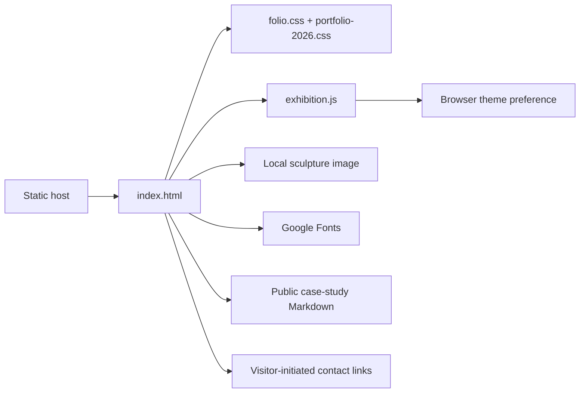

# Architecture

## System overview

This repository is a static portfolio, not the applications it describes. It has
no backend, API routes, database, migrations, authentication, Docker setup or
package/build configuration. Audited project stacks must not be confused with
the portfolio's own runtime.

## Frontend structure

`index.html` owns metadata, initial theme selection, Person JSON-LD and six sections:
hero (`top`), selected work (`work`), current builds (`current`), public lab (`lab`),
about and contact. Five tab buttons map to five panels through `aria-controls` and
`aria-labelledby`. Qashoryx starts selected; other panels use `hidden`.

`folio.css` establishes typography, electric-blue/monochrome surfaces, base layout,
themes, mobile breakpoints, focus styles and reduced-motion behavior.
`portfolio-2026.css` loads second and overrides/extends featured tabs, visuals,
current-build cards and static availability/contact elements. Existing grid/card
styling is retained; fallback rules expose content without successful enhancement.

`exhibition.js` is a deferred strict-mode IIFE containing interaction behavior only.
Availability, recruiter/business cards, contact directory/dock and Person JSON-LD
are static HTML. No module system or router is involved. The `enhanced` class is
added after initialization; without it CSS exposes all projects/navigation and
hides inactive controls.

## State, data and navigation

- The only local persisted state is `exhibition-theme` in localStorage. Inline
  startup chooses stored preference or system preference, with system preference fallback
  when storage fails. Stored values are allowlisted to light/dark. JavaScript keeps
  button text and theme-color in sync.
- Theme toggling stores a preference if possible and remembers the choice in memory.
  System changes apply only without an explicit choice, including when storage fails.
- The mobile menu toggles `.open` and ARIA state; link activation/Escape closes it.
- Project tabs maintain selection, roving tabindex and panel visibility; arrows,
  Home and End move selection/focus.
- `#qashoryx`, `#phishguard`, `#pynivo`, `#vendiqo` and `#fixloom` select a panel.
  `#products`/`#atlas` scroll to work; `#principles` scrolls to about. Native section
  anchors handle the remaining navigation. Tab clicks do not update the URL hash.
- Mouse motion adjusts artwork CSS variables; reduced motion disables the effect.
- Project content and statistics are hand-reviewed static strings. There is no
  runtime GitHub fetching, recommendation engine or user/business record storage.

## Contact workflow and external integrations

GitHub/LinkedIn links are visitor-initiated external navigation. Email and phone use
`mailto:`/`tel:`. WhatsApp uses `wa.me` with URL-encoded recruiter, business and general
messages. It prepares text; the visitor remains responsible for sending it.
Google Fonts loads Space Grotesk and IBM Plex Mono; CSS has local fallback fonts.
The local PNG is decorative. No analytics, payment SDK or tracking code was found.

## Error handling and security architecture

Storage failures are caught; JSON-LD needs no runtime enrichment. Font loading can fall back to
local fonts. The main DOM bindings assume this specific HTML structure; missing
elements can stop subsequent script initialization. There is no global error handler.

There is no runtime HTML injection or network data ingestion. Current `location.hash` use is lookup only.
External new-window links have `rel="noreferrer"`. No credentials or authenticated
server boundary are required. Public contact details are intentionally visible.

No CSP/security-header file is tracked. Inline startup/JSON-LD, Google Fonts and
data-URL favicon must be accounted for if headers are added later. HTTP headers
and platform settings cannot be inferred from the source. See the dated audit's
lightweight security findings; it is not a vulnerability certification.

## Testing architecture

Node interaction tests execute the shipped scripts with a small DOM/event fake.
Python contract tests check deployment parity/allowlist, local references, HTML/ARIA
relationships, static contact messages and JSON-LD. A read-only GitHub Actions
quality gate runs tests, syntax and whitespace checks. No browser E2E, linter or
formatter is configured. See [testing](testing.md) for limits and manual acceptance.

## Deployment architecture

Root assets are the editing source; `dist/` contains tracked static mirrors of
HTML, both CSS files, JS, artwork and public case study. The unused Sites manifest
was removed on 5 October 2026. New continuity documents are repository-only and
do not need deployed copies.
There is no bundler. `scripts/sync_dist.py` copies the explicit seven public assets;
`check_site.py` rejects drift or unexpected deployed files before publication.
GitHub Pages at https://asadabbas717.github.io/ is the active hosting destination.
The homepage ownership notice and permission page returned HTTP 200 and their
expected content on 5 October 2026. Hosting settings and response headers were
not audited. Removing the Sites manifest does not delete the remote Sites copy;
its owning account remains inaccessible through the connected account.

## Technical limitations

Tracked duplication remains, with repeatable sync and parity checks. Contact content
and all projects remain available when scripts fail/are disabled. Google Fonts
adds an external request. Case-study Markdown display depends on the host/browser.
Historical test/release numbers need periodic audited refreshes. Browser checks do
not establish accessibility certification or exhaustively cover old browsers.
